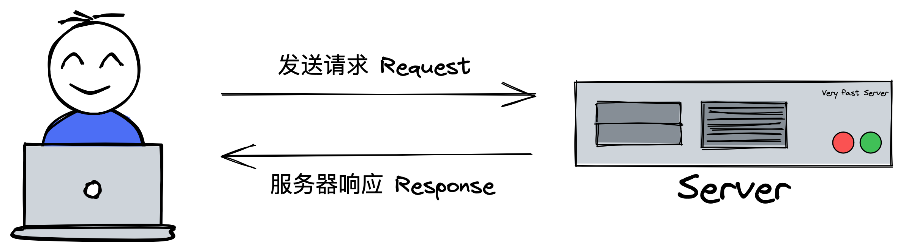
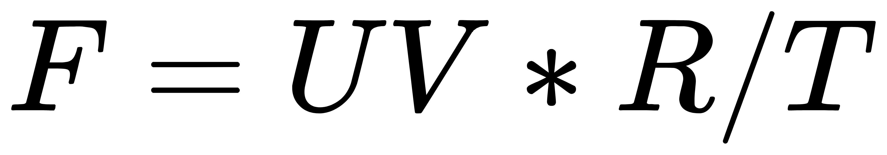
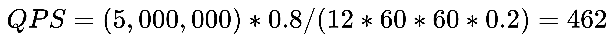

# 【高并发系统】什么是高并发系统

## 一、什么是高并发系统

## 二、高并发系统的关键指标
> 响应时间、吞吐量、QPS、TPS、PV、UV、网络流量

### 响应时间(Response Time)

响应时间从第一次发出请求开始计算，一直到接收到完整数据响应结束。

响应时间越短，用户体验越好，说明系统性能越高。

响应时间长说明系统性能差，甚至会丢失相关请求或出现系统不可用情况。

### 吞吐量(Throughput)[θruːˈaʊt]

单位时间内系统所处理的用户请求数。

F：吞吐量

`VU（Virtual User）`：虚拟用户个数

`R（Request）`：虚拟用户发出的请求数

`T（Time）`：所用时间

### 每秒请求数 QPS （Query per Second）

QPS 指服务器每秒处理了多少个（读）请求。

#### 预估 QPS

假定：
1. 绝大部分请求在白天发出
2. 二八定律，80% 的请求出现在 20% 的时间段内
3. 每天有 5,000,000 个请求

保险起见，一般会多预留 20%

机器数 = 峰值 QPS / 单台机器最高可承受的 QPS

*单台机器最高可承受的 QPS 由压测得出*

### 每秒事务数 TPS （Transaction per Second）[træn'zækʃn]

### 访问量

### 独立访客

### 网络流量

## 三、为什么要学习高并发系统

## 四、对比单体系统、分布式系统和微服务系统