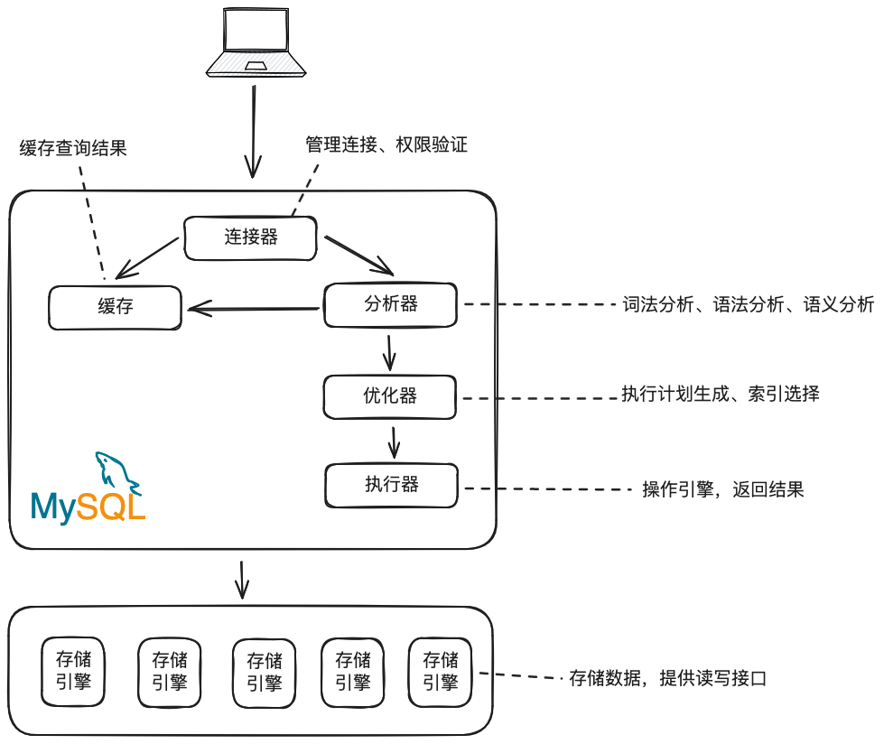

# MySQL 基础架构：一条 SQL 语句是如何运行的

## MySQL 架构

从整体结构上，MySQL 可以分为服务层 (Server) 和存储引擎层。

【服务层】 包括连接器、缓存、分析器、优化器、执行器等，涵盖大部分核心服务功能，以及所有内置函数，所有 **跨存储引擎** 的功能都在服务层实现。

【存储引擎层】主要负责数据存储。其架构是插件式的，支持 InnoDB、MyISAM、Memory 等多种存储引擎。从 MySQL5.5.5 开始，Inno DB 作为 MySQL 的默认存储引擎。



### 连接器

主要作用：

1. 建立连接
2. 获取权限
3. 维持和管理连接

在通过认证之后连接器会从权限表里查询账号拥有的权限，此后连接器中所有的权限判断逻辑都依赖此次获取到的权限信息。

连接的状态：

1. 空闲状态，连接完成但没有后续操作时连接处于空闲状态。

    ```sql
    -- 查看连接
    show processlist;
    ```

2. 断开，如果连接长时间处于空闲状态且空闲时间超过 `wait_timeout` 设置的值后，连接器会自动将连接断开。

连接类型：

* 长连接：如果客户端持续有请求则一直使用同一个连接
* 短连接：执行完几次查询后就断开，下次查询再重新创建新连接

建立连接的过程相对比较复杂，在开发过程中尽量减少使用短连接以减少创建连接所执行的操作。但长连接有一个缺点：MySQL 在执行过程中使用的内存在连接对象里，部分资源只会在连接断开后才会回收，这就回导致长时间积累下来后 OOM。

长连接资源占用过大的解决方案：

1. 部分资源在连接断开后会自动回收，那么长连接只需要定期断开就能够解决资源占用过多的问题。
2. MySQL 提供了 API 来初始化连接资源：`mysql_reset_connection`，这个过程不需要做鉴权和重连操作。

### 查询缓存

建立完连接后开始执行第二个步骤：查询缓存，同日常开发的接口缓存一样，MySQL 在接收到 SQL 查询请求后会去缓存中查询该 SQL 之前是否执行过，如果执行过则直接返回缓存中的结果。缓存中数据的存储方式同 Redis 类似，以 Key-Value 的形式存储。

但是缓存中数据失效的非常频繁，当表中的数据有更新时，缓存中所有与该表相关的数据都会失效。如果一张表的数据经常发生更新操作，则该表的缓存命中率会很低，其写入缓存的成本会远高于查询缓存所带来的性能提升。

### 分析器

若 SQL 没有命中缓存或关闭了缓存，则 MySQL 开始执行 SQL 语句了。

* 词法分析：解析 SQL 字符串中有什么，代表什么。

* 语法分析：判断 SQL 是否满足 MySQL 语法要求。
* 语义分析：TODO

### 优化器

经过分析器的处理之后 MySQL 已经知道了 SQL 要做什么了，但是在执行之前还需要做一次优化。

优化内容

1. 多索引时选择索引
2. 多表关联（Join）时决定连接顺序

经过优化器的处理之后，SQL 的执行方案就确定下来了，然后开始进入执行器阶段。

### 执行器

进入执行器阶段，MySQL 则按照执行计划去调用执行引擎的 API 执行计划。

## 数据更新流程

### redo log 模块

当我们执行一条更新 SQL 时，其目的是为了从数据库中找到我们要修改的数据，修改后再写入到数据库中。但是当修改请求的操作很多时此种方法有效但是不高效，IO 成本过高。

为了提升更新效率，InnoDB 引擎在执行更新操作时会先把记录写到 `redo log` 中并更新内存，此时更新操作就执行完毕了。当 InnoDB 在空闲的时候会将操作记录更新到磁盘中。

InnoDB 的 redo log 是固定大小的，例如配置一组四个文件，每个文件 1GB 大小，那么总共可以记录 4GB 大小的操作。`操作` 的写入是循环的，通过 `write pos` 和 `check point` 两个标记位实现。`write pos` 表示当前记录的位置，`check point` 表示要擦除的位置，write pos 和 check point 之间是 `操作` 可写入部分。

redo log 这种方式叫 `crash-safe`

### binlog 模块

## 问答

1. 执行一条 SQL：`select k from T`，若 T 表中没有字段 k，则该 SQL 会在那个步骤被校验出错误？

## TODO 和问题

1. `mysql_reset_connection` 执行后连接处于什么样的状态，回收了哪些资源？
