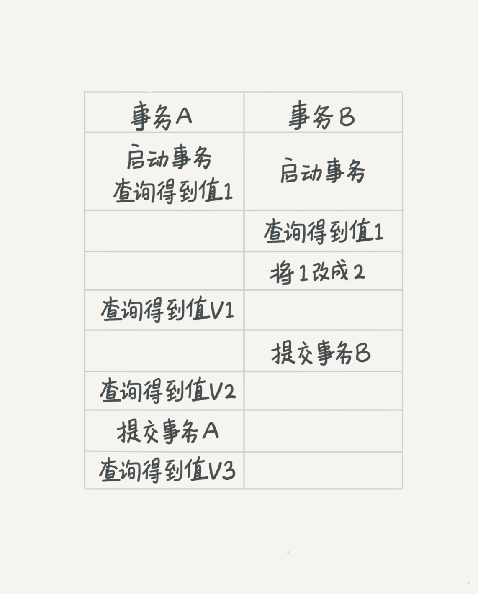
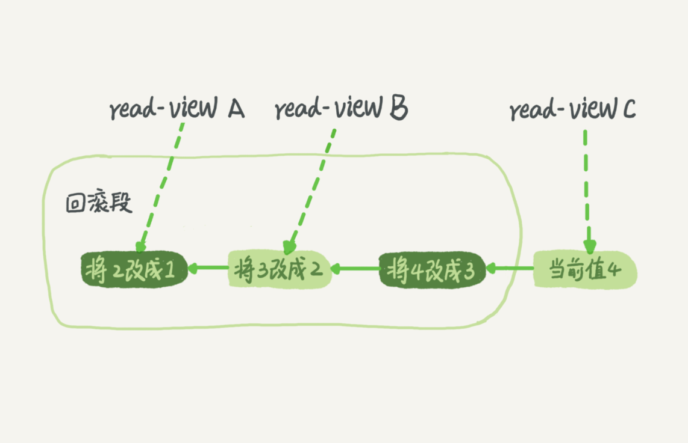

# MySQL 事务

什么是事务？

事务是一系列操作组成的逻辑工作单元，该工作单元要么全部执行，要么全部不执行，当其中有一步执行失败时已经执行的操作要进行回滚。

为什么要使用事务？

保证一组数据操作的原子性。

## 隔离性与隔离级别

ACID

A：Atomicity（原子性）

C：Consistency（一致性）

I：Isolation（隔离性）

D：Durability（持久性）

脏读（dirty read）

不可重复读（non-repeatable read）

幻读（phantom read）

隔离级别：

* 读未提交（read uncommitted）：一个事务还没有提交时它做的变更就能被其他事务看到。
* 读提交（read committed）：一个事务提交后它做的变更就能被其他事务看到。
* 可重复读（repeatable read）：一个事务在执行过程中看到的数据与事务启动时看到的数据是一致的。
* 串行化（serializable）：对于同一行数据读写操作都会加锁，其他事务在进行读写操作时要等待锁被释放。

|          |  V1  |  V2  |  V3  |
| :------: | :--: | :--: | :--: |
| 读未提交 |  2   |  2   |  2   |
|  读提交  |  1   |  2   |  2   |
| 可重复读 |  1   |  1   |  2   |
|  串行化  |  1   |  1   |  2   |

四种隔离级别的应用场景都有哪些？

可重复读：读取一段静态数据，即在读取期间其他事务的更新操作不能影响已读数据，例如查询某段时间的交易明细。

## 事务隔离的实现

MySQL 中每条记录在更新的时候都会记录一条回滚操作，例如执行 `update T set col = 2 where ID = 1`  的时候也会记录一条 `set col = 1` 的操作，通过回滚操作可以将记录从当前值回滚到前一个状态的值。

假设一个值从 1 更新到 2、3、4，那么就会产生如上图所示的回滚记录，不同时刻启动的事务都有不同的 read-view。

每个事务在开启时会创建一个唯一的事务 ID（Transaction ID：TXID）。每个数据行都会记录该数据行最近一次被修改的事务 ID，此外每个记录行都会记录该数据行被删除的 TXID（没有则为 NULL）。

判断数据行对当前事务是否可见的规则：

1. 数据行最近修改的 TXID 大于当前 TXID，则表示该数据行是由尚未提交的事务修改的，对当前事务不可见（读提交）。
2. 数据行最近修改的 TXID 小于当前 TXID，且数据行删除标记为真（数据被删除），对当前事务不可见（因为数据在当前事务开启前被删除了）
3. 数据行最近修改的 TXID 小于当前 TXID，且数据行删除标记为假（数据还存在），则数据行对当前事务可见。

## QA

1. 为什么你修改了我还看不见？
   1. 隔离级别为读提交，你修改了但未提交，我看不见。
   2. 隔离级别为可重复读，你修改了但我看见的还是事务开启时的初始值。

## TODO 和问题
