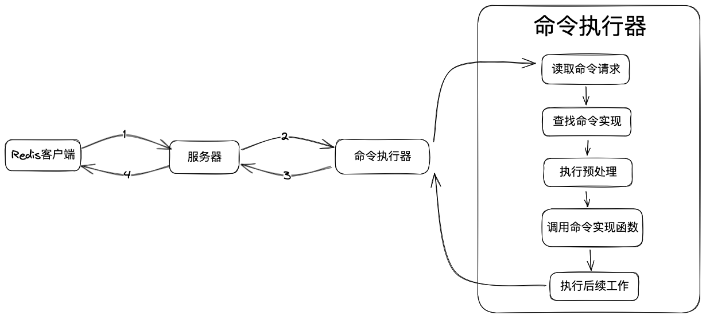

# Redis 命令的执行过程

## 目标

1. 了解一条 redis 命令的执行过程
2. 梳理学习 redis 原理的流程

## Redis 支持哪些数据类型

1. 字符串 (String)
2. 哈希 (Hash)
3. 列表 (List)
4. 集合 (Set)
5. 有序集合 (Sorted Set,ZSet)

## Redis 命令执行流程概览

用户键入 `set <key> <value>` 后客户端收到 OK 回复的完整流程

1. 用户通过 Redis 客户端向 Redis 服务器发送请求
2. 服务器接受客户端发送的 set key value，在数据库中执行操作，最后产生命令向客户端返回 `OK`
3. 服务器将命令回复 `OK` 发送回客户端
4. 客户端接收回复并打印给用户看

问题：

1. 客户端是如何与服务器进行通讯的，通讯的协议是什么
2. 服务器是如何解析并执行客户端传递过来的命令并执行的，不同命令的执行流程是怎么样的

## `set key value` 的执行流程

1. 发送命令请求
2. 读取命令请求
3. 查找命令实现
4. 执行命令预备操作
5. 调用命令的实现函数
6. 执行后续工作
7. 返回命令回复给客户端
8. 客户端接收回复并打印

1. 客户端将命令请求转换成协议内容
2. 读取套接字中的命令请求并保存到客户端状态的输入缓冲区

### 发送命令请求

Redis 服务器的命令请求来自 Redis 客户端，当用户在客户端键入命令后，客户端会将命令请求转换成协议格式，然后连接服务器套接字，将协议格式的命令请求发送给服务器。
