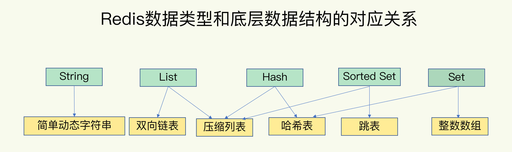

# Redis 底层数据结构及对象

## 底层数据结构



可存储数据类型：

* 字符串
* 列表
* 哈希
* 集合
* 有序集合

列表、哈希、集合、有序集合因其 Key 对应一个集合又被称为集合类型。

底层数据结构

* SDS
* 双向链表
* 压缩列表
* 哈希表
* 跳跃表
* 整数数组

### 1. 简单动态字符串 SDS

SDS (Simple Dynamic String)

### 字典

## Redis 中的对象

Redis 实际存储的时候并不是直接使用上述的几种数据结构，而是基于这些数据结构创建了一套对象系统。

这个系统包含：

* 字符串对象
* 列表对象
* 哈希对象
* 集合对象
* 有序集合对象

每一种对象都由不同的数据结构去实现。

Redis 中对象的数据结构如下：

```c
struct redisObject {
    unsigned type:4;
    unsigned encoding:4;
    unsigned lru:LRU_BITS; /* LRU time (relative to global lru_clock) or
                            * LFU data (least significant 8 bits frequency
                            * and most significant 16 bits access time). */
    int refcount;
    void *ptr;
};
```

type: 对象的类型。
encoding: 对象的底层数据结构
lru: 对象最后一次访问时间到当前的间隔。
refcount: 当前对象的引用数量。
ptr: 指向 encoding 对应数据结构在内存中位置的指针。

**type** 表示对象的 *类型*，用下面 5 中类型常量表示：

* 字符串对象 [OBJ_STRING]
* 列表对象 [OBJ_LIST]
* 集合对象 [OBJ_SET]
* 有序集合对象 [OBJ_ZSET]
* 哈希对象 [OBJ_HASH]

**encoding** 表示对象的 *实现方式*，用下面 8 种编码常量表示：

```c
/* Objects encoding. Some kind of objects like Strings and Hashes can be
 * internally represented in multiple ways. The 'encoding' field of the object
 * is set to one of this fields for this object. */
#define OBJ_ENCODING_RAW 0     /* Raw representation */
#define OBJ_ENCODING_INT 1     /* Encoded as integer */
#define OBJ_ENCODING_HT 2      /* Encoded as hash table */
#define OBJ_ENCODING_ZIPMAP 3  /* No longer used: old hash encoding. */
#define OBJ_ENCODING_LINKEDLIST 4 /* No longer used: old list encoding. */
#define OBJ_ENCODING_ZIPLIST 5 /* No longer used: old list/hash/zset encoding. */
#define OBJ_ENCODING_INTSET 6  /* Encoded as intset */
#define OBJ_ENCODING_SKIPLIST 7  /* Encoded as skiplist */
#define OBJ_ENCODING_EMBSTR 8  /* Embedded sds string encoding */
#define OBJ_ENCODING_QUICKLIST 9 /* Encoded as linked list of listpacks */
#define OBJ_ENCODING_STREAM 10 /* Encoded as a radix tree of listpacks */
#define OBJ_ENCODING_LISTPACK 11 /* Encoded as a listpack */
#define OBJ_ENCODING_LISTPACK_EX 12 /* Encoded as listpack, extended with metadata */
```

* SDS 字符串 [OBJ_ENCODING_RAW]: 0
* Long 类型 [OBJ_ENCODING_INT]: 1
* 字典 [OBJ_ENCODING_HT]: 2
* 双向链表 [OBJ_ENCODING_LINKEDLIST]: 4
* 压缩列表 [OBJ_ENCODING_ZIPLIST]: 5
* 整数集合 [OBJ_ENCODING_INTSET]: 6
* 跳跃表和字典 [OBJ_ENCODING_SKIPLIST]:7
* EMBSTR 编码的字符串 [OBJ_ENCODING_EMBSTR]: 8
* QuickList: [OBJ_ENCODING_QUICKLIST]: 9
* QuickList: [OBJ_ENCODING_STREAM]: 10
* QuickList: [OBJ_ENCODING_LISTPACK]: 11
* QuickList: [OBJ_ENCODING_LISTPACK_EX]: 12

ptr 则是一个指向 **底层数据结构内存地址** 的指针。

### 1. 字符串对象

字符串对象的实现编码：

* Long 类型 [OBJ_ENCODING_INT]
* EMBSTR 编码的字符串 [OBJ_ENCODING_EMBSTR]
* SDS 字符串 [OBJ_ENCODING_RAW]

#### Long

当一个字符串对象保存的是 **整型**，且这个整型可以用 Long 来表示，那么字符串对象会将 ptr 指针属性转换成 Long 类型并将整数值整数值保存在里面。

::: tip

C 语言中 指针类型和 Long 类型所占用的存储空间是一样的。

32 位系统：4 Byte (32 Bit)

64 位系统：8 Byte (64 Bit)

:::

#### 简单动态字符串 (SDS)

当字符串对象保存的是一个长度大于 **44** 字节的字符串时，底层采用的实现方式是 **简单动态字符串 (SDS)**。

```c
#define OBJ_ENCODING_EMBSTR_SIZE_LIMIT 44
```

执行如下命令时：

```bash
SET story "Long, long, long ago there lived a king ..."
```

由于保存的字符串长度大于 39 字节，Redis 在创建字符串对象时会分配两次内存空间：

1. 第一次分配给 RedisObject
2. 第二次分配给 SDS

并使用 ptr 指针将二者关联。

#### EMBSTR 编码

当字符串对象保存的是一个长度小于或等于 **39** 字节 (Byte) 的字符串时，其底层实现是 **EMBSTR** 编码，EMBSTR 是一种专用于保存 *短字符串* 的一种优化编码方式。

因为使用的是 EMBSTR，Redis 通过此种方式存储字符串时只需要分配一次连续的内存空间，将 RedisObject 和 EMBSTR 连续存储。

#### 字符串对象编码的转换

INT 编码和 EMBSTR 编码的字符串在超过限制后会自动转换成 SDS 存储。

INT 编码只能存储 Long 能表示的整数，超过后就会使用 SDS 存储。

Redis 没有提供对 EMBSTR 编码的操作，当对 EMBSTR 编码的字符串操作后会自动转换成 SDS 存储，因此可以理解为 EMBSTR 字符串对象是 “只读” 的。

### 2. 列表对象

列表对象的实现编码：

* 压缩列表 [REDIS_ENCODING_ZIPLIST]
* 双向链表 [REDIS_ENCODING_LINKEDLIST]

#### 压缩列表编码

当列表元素同时满足下面两个条件时会使用压缩列表编码实现：

1. 列表中所有的字符串元素的长度都小于 64 字节。
2. 列表中元素的个数小于 512 个。

其中 64 字节和 512 个这两个上限是可配置的，分别是：***list-max-ziplist-value*** 和 ***list-max-zip-list-entries***。

#### 双向链表编码

在不满足使用压缩列表编码的其他情况都使用双向链表编码实现。

#### 列表对象编码的转换

在使用压缩列表实现列表时，当使用压缩列表的两个条件任意一个不满足时 Redis 都会将其转换为双向链表实现。

### 3. 哈希对象

哈希对象的实现方式：

* 压缩列表 [REDIS_ENCODING_ZIPLIST]
* 字典 [REDIS_ENCODING_HT]

#### 压缩列表编码

当哈希对象同时满足下面两个条件时会使用压缩列表编码实现：

1. 哈希对象中所有保存元素的键和值的字符串均小于 64 字节。
2. 哈希对象中保存键值对的个数小于 512 个。

其中 64 字节和 512 个这两个上限是可配置的，分别是：***hash-max-ziplist-value*** 和 ***hash-max-zip-list-entries***。

#### 字典编码

在不满足使用压缩列表编码的其他情况都使用字典编码实现。

#### 哈希对象编码的转换

在使用压缩列表实现哈希时，当使用压缩列表的两个条件任意一个不满足时 Redis 都会将其转换为字典实现。

### 4. 集合对象

集合对象的实现方式编码：

* 整数集合 [REDIS_ENCODING_INTSET]
* 字典 [REDIS_ENCODING_HT]

#### 整数集合编码

当集合对象满足下面两个条件时会使用整数集合实现：

1. 集合对象中所有元素都是整数值。
2. 集合对象中保存元素的个数不超过 512 个。

其中 512 的限制可以通过 ***set-max-intset-entries*** 配置。

#### 字典编码

在不满足使用整数集合的条件时，集合对象会使用字典实现，其中值保存在字典的 key 中，value 为 null。

#### 集合对象编码的转换

### 5. 有序集合对象

有序集合对象的实现编码：

* 压缩列表 [REDIS_ENCODING_ZIPLIST]
* 跳跃表和字典 [REDIS_ENCODING_SKIPLIST]

#### 压缩列表编码

#### 跳跃表和字典编码

#### 有序集合对象编码的转换
