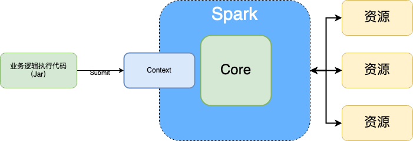

# Spark

## 基础概念

基于 MR 开发的

区别：

* MR：
  * Java 开发的，不适合大量数据的处理
* Spark：
  * Scale 开发的，适合大量数据的处理

分布式

* 单机：单进程、单节点
* 伪分布式：多进程、单节点
* 分布式：多进程、多节点

计算

* 单机计算：
* 分布式计算：将数据切分由各个节点的多个进程同时计算

计算方式

* 单一计算：读数据->处理数据->写数据
* 迭代式计算：读数据->处理数据 1->处理数据 2->处理数据 N->写数据

分布式存储
分布式消息传输

分布式集群

* 集群中心化
* 集群去中心化

Spark 采用的是集群中心化： 1 Driver + N Executor



## Spark 部署

根据节点模式：

* 单机模式：资源由单个节点提供

* 分布式模式：资源由多个节点提供

根据资源调度系统分类：

* SparkOnYarn：资源由 Yarn 提供

* Standalone：资源由 Spark 自身的资源调度系统提供

## Spark Example

Spark 提供了官方案例

```bash
bin/spark-submit \
--class org.apache.spark.examples.SparkPi \
--master local[2] \
./examples/jars/spark-examples_2.12-3.4.3.jar \
10
```

spark on yarn 模式执行

deploy-mode 默认 client

```bash
# 不指定 deploy-mode 和指定 deploy-mode 为 client 是一样的
bin/spark-submit \
--class org.apache.spark.examples.SparkPi \
--master yarn \
--deploy-mode client \ 
./examples/jars/spark-examples_2.12-3.4.3.jar \
10
```

cluster 模式运行

```bash
bin/spark-submit \
--class org.apache.spark.examples.SparkPi \
--master yarn \
--deploy-mode cluster \
./examples/jars/spark-examples_2.12-3.4.3.jar \
10
```
