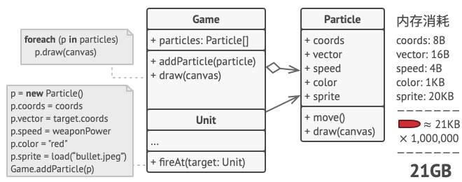
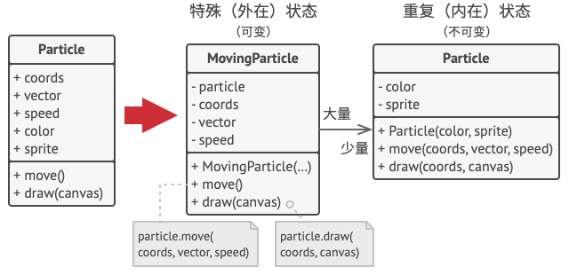
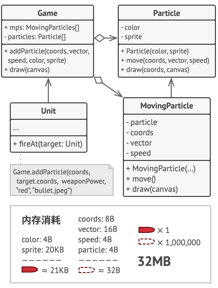
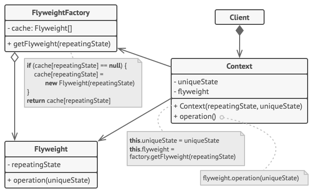

# 享元模式

::: tip
享元：缓存、Cache、Flyweight
:::

## 什么是享元模式

一种能够共享对象（相同状态）减少内存使用的设计模式。

享元模式将对象间相同的成分抽离出来并在这些对象之间共享以达到节省内存空间的目的。

优点：

1. 通过减少创建对象，使用共享对象，降低内存的使用。
2. 减少对象创建时间，提高系统效率。

缺点：

1. 牺牲执行速度，每次调用享元方法都需要重新计算部分对象数据。
2. 代码复杂度提高，新人可能不知道对象状态拆分的原因。

什么时候使用享元模式：

1. 程序需要创建大量相似的对象，有可能耗尽设备的内存空间。
2. 存在能在多个对象之间共享的重复信息或状态。

## 为什么要使用享元模式

假设有一款类似打飞机的游戏，游戏界面上有大量的微粒（子弹、射线等），若每个微粒都对应一个对象，那么其占用的内存空间将会很大。

对象的常量数据通常被称为内在状态，其位于对象中，其他对象只能读取但不能修改。而对象的其他状态常常被称为外在状态，可以被其他对象从外部改变。

享元模式建议不在对象中存储*外在状态*， 而是将其传递给依赖于它的一个特殊方法。程序只在对象中保存内在状态， 以方便在不同情景下重用。 这些对象的区别仅在于其内在状态 （与外在状态相比， 内在状态的变体要少很多）， 因此你所需的对象数量会大大削减。

因此可以将 Particle 中的完全一样的对象抽离处理，例如：color 和 sprite（精灵图）。

Particle 对象中的可变数据 coords、vector、speed 可以抽离出 Particle，使 Particle 只保留常量数据 color 和 sprite。

然后新建对象：MovingParticle 包含可变数据 coords、vector、speed，并与 Particle 关联。

享元模式的结构：

## 享元模式的应用

### 实现步骤

1. 将需要改写为享元的类拆分为两个部分：
   * 内在状态：包含不变的、可在许多对象中重复使用的数据的成员变量。
   * 外在状态：包含每个对象各自不同场景的数据的成员变量。
2. 保留类中表示内在状态的成员变量，并将其属性设置为不可修改，仅可在构造函数中获得初始值。
3. 找到所有使用外在状态成员变量的方法，为在方法中所用的每个成员变量新建一个参数，并使用该参数代替成员变量。
4. 创建工厂类管理享元缓存池，他负责在新建享元时检查已有的享元。
5. 客户端必须存储和计算*外在状态*的数值，只有这样才能调用*享元对象*的方法，*外在状态*和*引用享元的成员变量*可以移动到单独的情景类中。

## 概念总结

**享元**：原始对象中部分能在多个对象中共享的一种状态。

**情景**：原始对象中各不同的外在状态。享元和情景就能表示原始对象的所有状态。

**享元工厂**：通过传递享元的内在状态获取享元对象，享元工厂内部管理了享元对象，会根据传递的内在状态判断享元对象是否已经存在在享元缓存池中，并选择返回已有享元对象或创建新享元对象放入缓存池中并返回。
