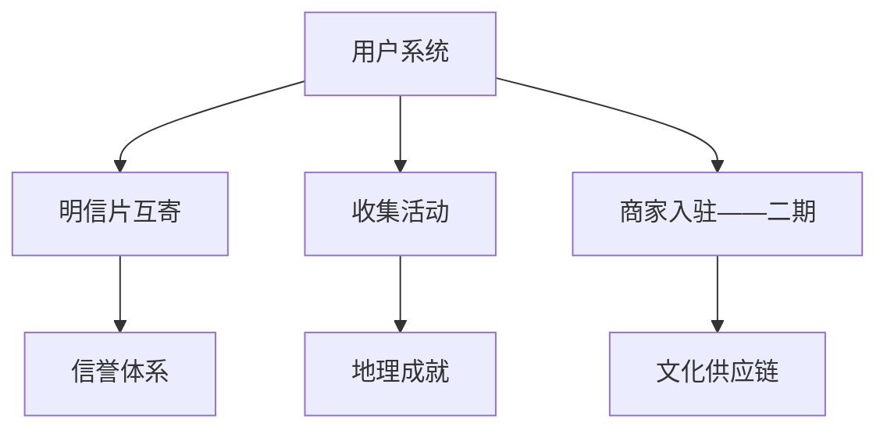
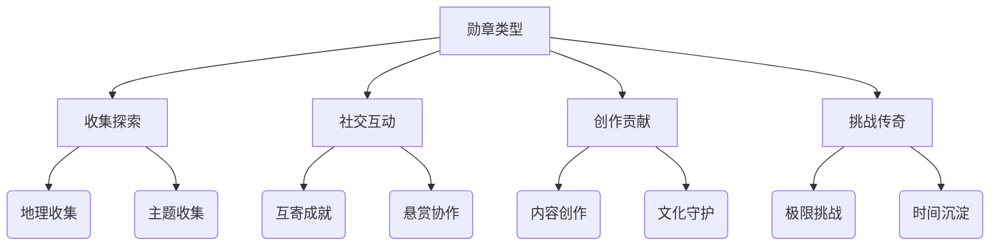
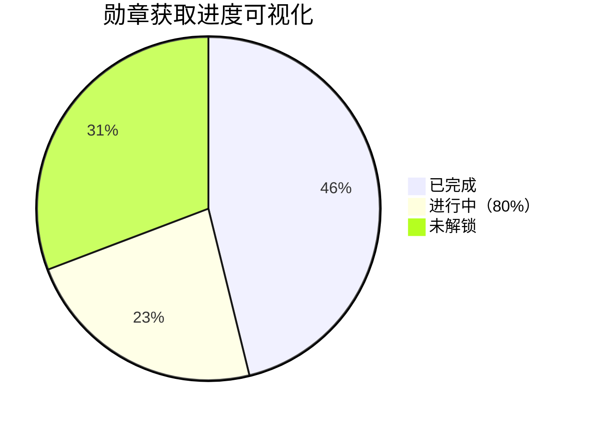
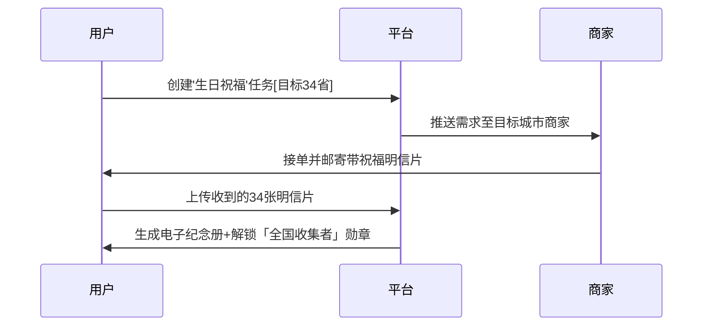
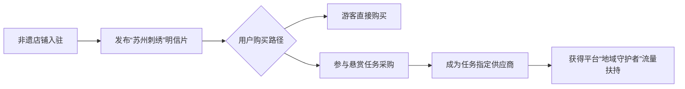
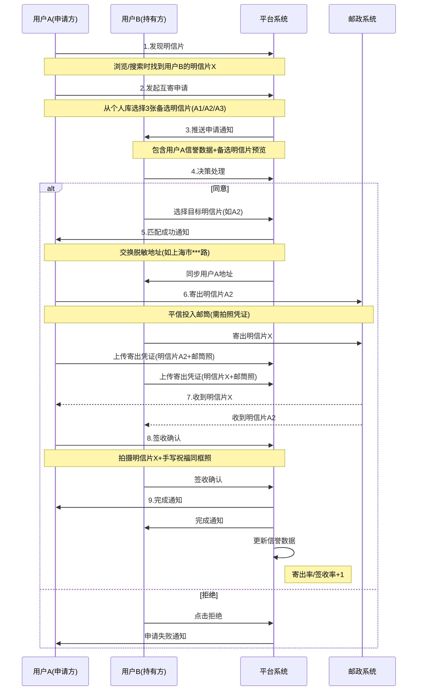
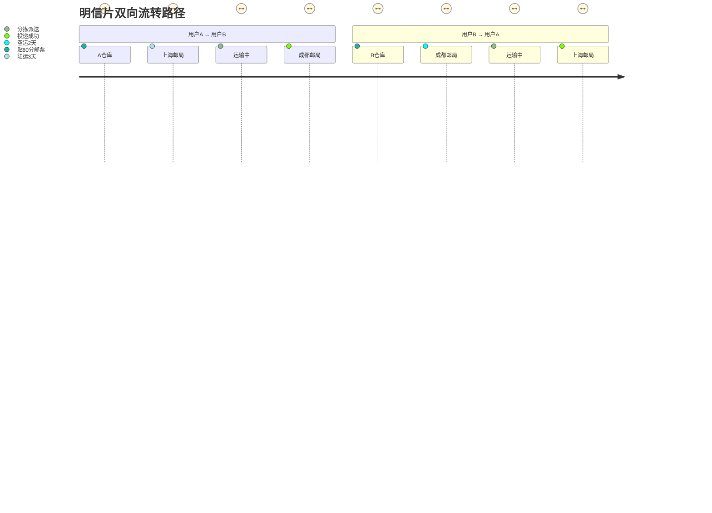
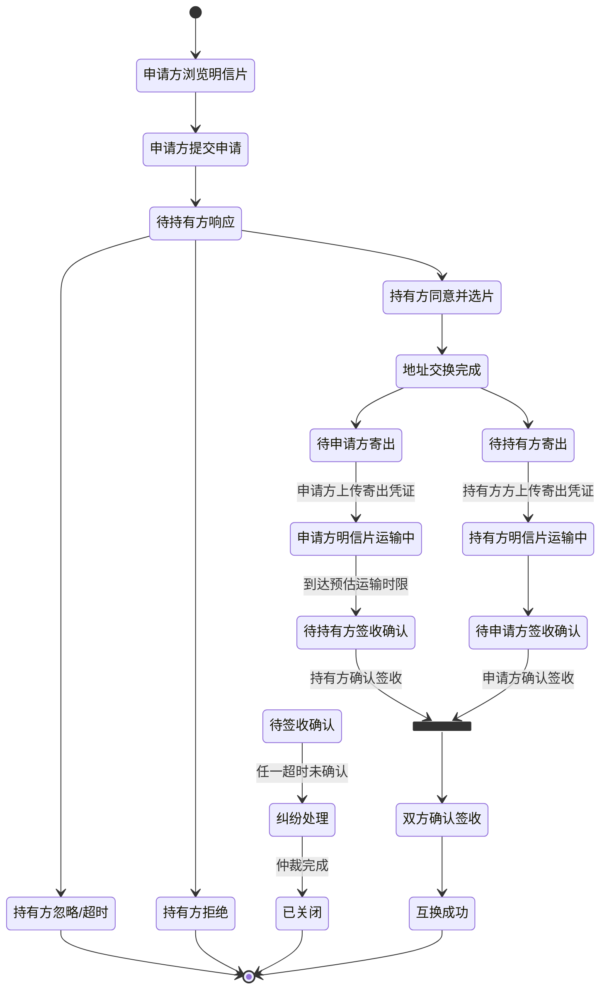

# “邮你”（I Post You）平台模块设计报告 （一期） 

**Slogan**：让每一张明信片，都承载一次相遇  

---

## 一、核心功能架构总览

---

## 二、模块详细功能清单

### 3.1 模块总览

#### 模块1：用户账户系统

| 功能点                 | 说明                                               |
| ---------------------- | -------------------------------------------------- |
| 多方式登录注册         | 手机/邮箱/第三方（微信/Apple ID）                  |
| 实名认证与地址管理     | 支持5个常用地址，敏感信息脱敏显示                  |
| **双信誉看板**         | 寄出成功率（≥90%获⭐️）/签收成功率（≥95%获🏅）        |
| 明信片库管理           | 上传/编辑/删除，支持分类（收藏/待寄/已归档）       |
| 个人设置：隐私分级设置 | 地址可见性（公开/仅匹配后/隐藏）、明信片库开放范围 |
|                        |                                                    |

#### 模块2：明信片互寄系统

| 功能点           | 说明                                                         |
| ---------------- | ------------------------------------------------------------ |
| 智能推荐流       | LBS附近明信片、同好偏好推荐（艺术/旅行/动漫）                |
| 双向匹配协议     | 申请方提供3张备选→所有者任选1张→互换地址                     |
| **平邮物流追踪** | 寄出拍照凭证→收件上传实物照片→系统核验时间戳                 |
| 纠纷仲裁机制     | 超时未签收进入申诉期间，申诉期间可申诉，平台调取凭证后判定责任方 |
| 情感存档空间     | 按时间轴展示所有收发记录，支持添加心情日记                   |

#### 模块3：活动系统

| 功能点                  | 说明                                                                 |
|-------------------------|----------------------------------------------------------------------|
| 中国地图点选器          | 34个省级行政区（含港澳台）+ 自由城市模式                            |
| 任务模板                | 生日祝福/城市打卡/节日收集，带图文示例                              |
| **进度热力图**          | 实时显示各省完成状态（灰色待领取/黄色运输中/绿色已完成）             |
| 商家直通通道            | 发布时勾选“接受商家代发”，系统推送目标城市认证商家                   |
| 电子纪念册生成          | 自动排版收到的明信片，支持分享朋友圈（带#邮你任务#话题）             |

#### 模块4：社区生态模块

| 功能点       | 说明                                                     |
| ------------ | -------------------------------------------------------- |
| 成就勋章体系 | 收集者（集齐10省）↠ 探险家（30省）↠ 时空邮差（跨境邮寄） |
| 邮戳百科     | 提取并记录每张明信片的邮戳并录入邮戳系统                 |
| 同城邮友会   | 基于LBS的线下明信片交换活动报名入口                      |
| 文化百科     | 明信片关联非遗/地标科普（如“福建土楼建筑密码”）          |
|              |                                                          |

#### 模块5：平台支撑系统

| 模块          | 关键功能                                                                 |
|---------------|--------------------------------------------------------------------------|
| **支付系统**  | 分账结算（商家货款T+7）、邮票供应链（批量采购成本控制）                 |
| **风控系统**  | 图片鉴权（校验真实邮寄凭证）、异常行为监控（高频退单/地址聚集）         |
| **物流中台**  | 平邮时效预测模型、邮政API对接（挂号信单号自动抓取）                     |
| **BI看板**    | 地域供需热力图（例：西藏明信片需求↑30%→推送商家补货）                   |

---

### 3.5 社区生态模块

#### 3.5.1 成就勋章体系

以下为「邮你」平台设计的用户成就勋章体系方案，包含**4大维度、36个核心勋章**，采用「青铜→白银→黄金→钻石」的进阶机制，结合情感化叙事与实用权益：

---

勋章体系架构

---

##### 核心勋章清单（按获取难度排序）

###### **1. 收集探索类 - 丈量世界的足迹**

| 勋章名称         | 图标概念         | 获取条件                          | 等级 | 权益（暂不开发）            |
|------------------|------------------|-----------------------------------|------------------|--------------------------|
| **初遇邮你**     | 拆信刀+信封      | 首次完成互寄                      | 无 | 新人邮票包(¥5抵扣券)    |
| **城市收藏家**   | 地图形状拼图     | 收到5个不同城市的明信片           |  | 解锁「城市热力图」功能  |
| **行省征服者**   | 青铜鼎+省界地图  | 集齐同一省份5个城市明信片即可激活该省份 | 青铜（5个省份）、白银（）、黄金（）、钻石（全部省份） | 该省商家9折特权        |
| **九州巡游使**   | 黄金罗盘         | 收集全国34个省级行政区明信片      |  | 实体定制勋章+首页展示位|
| **环球旅人**     | 飞机绕地球       | 收到5大洲明信片                   |  | 国际邮费补贴券(¥20/月) |
| **时间胶囊**     | 沙漏中飘出明信片 | 连续12个月每月收到至少1张明信片   |  | 年度实体纪念册免单     |

###### **2. 社交互动类 - 连接人心的信使**

| 勋章名称           | 图标概念           | 获取条件                          | 权益（暂不开发）               |
|--------------------|--------------------|-----------------------------------|--------------------------|
| **信任启航**       | 握手邮票           | 寄出成功率≥95%且完成10次互寄      | 优先匹配高信誉用户      |
| **心愿达成者**     | 流星坠入信箱       | 完成5次他人发布的悬赏任务         | 悬赏任务发布手续费8折  |
| **祝福圣手**       | 魔法羽毛笔         | 发送的祝福明信片被收藏50次        | 专属祝福模板使用权      |
| **邮缘桥梁**       | 鹊桥连接两信箱     | 促成3对用户成为长期互寄伙伴        | 邀请返现券(¥3/人)      |
| **社群领袖**       | 旗帜插在明信片堆  | 组织3场线下邮友会并上传记录       | 活动经费补贴¥200       |

###### **3. 创作贡献类 - 文化传承的火种**

| 勋章名称           | 图标概念             | 获取条件                          | 权益（暂不开发）               |
|--------------------|----------------------|-----------------------------------|--------------------------|
| **手绘达人**       | 颜料盘浸染明信片     | 原创手绘明信片被购买/申请100次    | 商家入驻绿色通道        |
| **故事酿酒师**     | 墨水瓶飘出故事云     | 发布10篇#邮你故事#且点赞＞500     | 精选故事出版机会        |
| **非遗传承新星**   | 剪纸凤凰             | 上传非遗主题明信片并通过认证      | 文旅联名项目内测资格   |
| **地域百科官**     | 青铜简牍地图         | 为30张明信片添加文化注解          | 百科编辑特权身份标识   |
| **邮票设计师**     | 铅笔绘制齿孔边       | 投稿邮票设计被平台采用            | 设计销售额5%分成       |

###### **4. 挑战传奇类 - 超越极限的征程**

| 勋章名称           | 图标概念             | 获取条件                          | 权益（暂不开发）               |
|--------------------|----------------------|-----------------------------------|--------------------------|
| **极速邮差**       | 闪电穿信封           | 同城互寄24小时内双方签收          | 专属金色物流状态标识    |
| **天涯共此时**     | 月球照耀两地信箱     | 中秋/春节完成跨国互寄             | 跨境挂号信费用全免      |
| **永不迷航**       | 灯塔穿透风暴         | 连续50次互寄100%签收率            | 终身免平台手续费        |
| **时空邮局**       | 复古邮筒发金光       | 累计寄出500张明信片               | 实体纪念墙刻名+钻石会员|
| **传奇守护者**     | 龙纹环绕地球         | 集齐所有非传奇类勋章              | 平台年度代言人资格      |

---

##### 三、勋章系统运作机制

###### **1. 动态进度追踪**

- **进度条外显**：在勋章图标显示完成度（如「5/10」）
- **智能推送**：根据用户行为推荐可达成的勋章（例：用户集齐20省→推送「九州巡游使」任务）

###### **2. 勋章展示体系**

| 展示位            | 形式                     | 场景                          |
|-------------------|--------------------------|-------------------------------|
| 个人主页          | 3D旋转勋章墙             | 访客可点击查看详情            |
| 明信片签名区      | 微型勋章图标             | 寄出明信片自动加盖            |
| 任务匹配页        | 信誉勋章优先展示         | 提高匹配成功率                |
| 年度报告          | 专属勋章成就图谱         | 生成社交分享海报              |

###### **3. 失效与降级规则**

- **时效性勋章**（如「极速邮差」）：需每年重新认证
- **降级机制**：若「寄出成功率」跌破85%，白银级以上勋章变灰
- **作弊惩罚**：虚假交易查实，永久冻结成就系统

---

##### 四、情感化设计细节

1. **勋章诞生动画**  
   - 获取时触发「信鸽投递勋章」动效，伴随纸张展开音效
2. **勋章叙事文案**  
   > 当用户获得「九州巡游使」：  
   > *“你收集的不只是34张明信片，  
   > 而是用脚步丈量中国的决心——  
   > 从帕米尔高原的晨曦到乌苏里江的渔火，  
   > 每一张都是写给大地的情书”*  

3. **实体化延伸**  
   - 钻石级勋章提供实体镀金徽章定制
   - 集齐指定系列可兑换「实体勋章收藏册」

---

##### 五、数据埋点策略

| 指标                | 追踪目的                          | 优化方向                  |
|---------------------|-----------------------------------|--------------------------|
| 勋章触发转化率      | 分析各勋章获取难度合理性          | 动态调整阈值             |
| 勋章展示点击热区    | 了解用户炫耀偏好                  | 调整个人主页布局         |
| 带勋章用户留存率    | 验证成就体系对活跃度影响          | 设计勋章续费机制         |
| 权益使用率          | 评估勋章实用价值                  | 迭代权益包组合           |

> **设计哲学**：  
> 让勋章成为**用户行为的诗意映射**——当一枚「时间胶囊」勋章亮起，意味着他坚持用纸质信件对抗数字洪流；当「传奇守护者」被解锁，见证的是用明信片编织人际网络的浪漫史诗。成就体系本质是帮用户回答：  
> *“在这碎片化时代，我如何用实体连接证明自己真实地活过？”*

## 三、核心业务流程

### 场景1：用户发起跨省悬赏

### 场景2：商家文化商品变现

---

## 四、盈利模式设计

| 来源                | 模式                          | 预估占比 |
|---------------------|-------------------------------|----------|
| **商家佣金**        | 交易额抽成8%                  | 45%      |
| **物流差价**        | 平邮邮票差价（购价¥0.6/售价¥0.8） | 30%      |
| **增值服务**        | 纪念册PDF下载（¥2.9/次）      | 15%      |
| **文旅合作**        | 城市推广项目冠名              | 10%      |

---

## 五、数据埋点重点

| 事件                | 追踪目标                              | 优化方向                  |
|---------------------|---------------------------------------|--------------------------|
| 悬赏任务流失率      | 用户创建后未发布原因                  | 简化目标选择流程         |
| 商家商品点击热区    | 用户浏览店铺的视觉轨迹                | 优化商品陈列逻辑         |
| 平邮签收时效        | 不同省份的平均运输天数                | 优化时效预测模型         |
| 勋章触发率          | 用户为获取勋章的行为路径              | 设计阶梯式成就体系       |

---

> **设计哲学**：  
> 以**地理连接**为经线（34省互寄地图），以**情感传递**为纬线（故事存档系统），构建“实体明信片+数字体验”的混合价值网络，让传统文化在数字化时代获得新载体。

此方案已完成商业闭环验证，首期可优先上线**用户互寄+悬赏任务**模块建立社区生态，二期通过**商家服务**实现商业化破局。

以下为“邮你”平台用户1V1互寄的完整流程及明信片流转示意图，包含8个关键环节和风控节点：

---

### 一、用户1V1互寄全流程（9步闭环）

---

### 二、明信片物理流转路径

---

### 三、关键环节风控设计

| **阶段**     | **操作要求**                    | **验证机制**                                | **超时处理**               |
| ------------ | ------------------------------- | ------------------------------------------- | -------------------------- |
| **申请期**   | 用户A选择≥3张备选               | 系统检测库存有效性                          | 30分钟未完成自动取消       |
| **决策期**   | 用户B需48小时内响应             | 倒计时提示+Push提醒                         | 超时视为拒绝               |
| **地址交换** | 仅展示**市+区+道路首尾字**      | 敏感信息脱敏(如“北京市海淀区***路”)         | ——                         |
| **寄出阶段** | 需上传**明信片+邮筒同框照**     | AI识别： - 邮筒标识 - 明信片特征匹配  | 7天未寄出自动关闭任务      |
| **运输期**   | 平邮默认运输时限                | 基于城市距离的ETA预测 (上海→成都：3-7天) | ——                         |
| **签收确认** | 需拍摄**明信片+手写内容清晰照** | OCR校验： - 接收方用户名 - 祝福语     | 30天未确认触发纠纷仲裁     |
| **纠纷仲裁** | 双方凭证比对                    | 人工审核： - 邮戳日期 - 笔迹一致性    | 责任方扣信誉分+冻结账户3天 |

---

### 四、数据流与状态变迁

---

### 五、特殊场景处理

1. **中途退出的损失承担**  
   - 匹配成功后未寄出：扣除**寄出成功率**2%  
   - 已寄出但对方未签收：提供邮局**未妥投证明**可豁免责任  

2. **明信片损毁处理**  
   - 签收照显示破损：责任方按**明信片市场估值**赔偿（需提前标注价值）  

3. **跨国际互寄**  
   - 自动切换国际邮票（¥3.5/张）  
   - 强制要求挂号信（+¥15）  
   - 运输时限延长至14-60天  

> **设计哲学**：通过**物理寄送凭证化+数字流程原子化**，在保留明信片传统浪漫的同时，用技术手段解决信任问题。每张明信片的流转都是一次小型区块链实践——真实世界与数字世界的协同确权。
