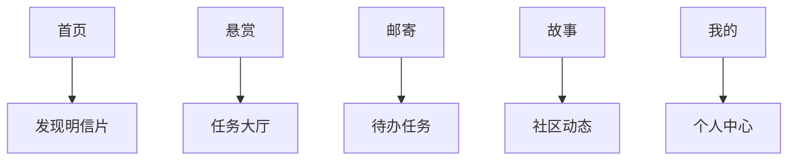
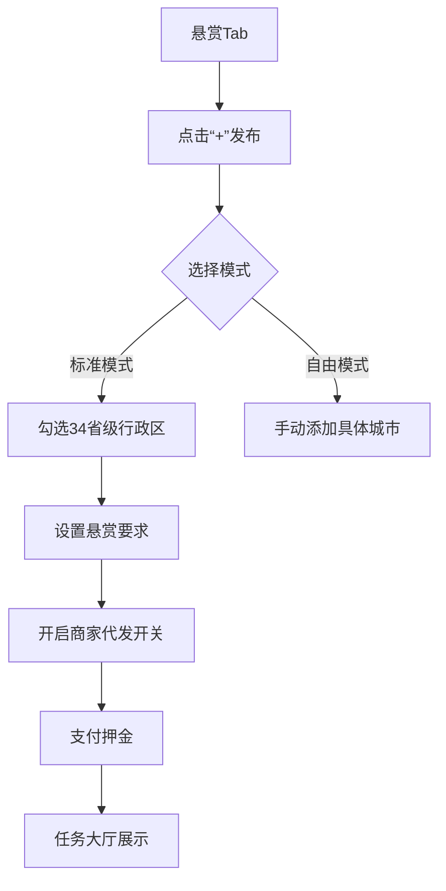

# 「邮你」（I Post You）移动端APP的完整页面架构设计

以下是基于功能模块划分的**5个主Tab导航+28个核心页面**：

---

## **一、主导航结构**



---

### **二、页面详细清单**

#### **Tab 1：首页（发现）**

| 页面名称             | 核心功能                                                                 | 关联功能点                  |
|----------------------|--------------------------------------------------------------------------|----------------------------|
| **推荐发现页**       | 瀑布流展示：附近明信片/LBS推荐/热门悬赏/商家精选                         | 智能推荐算法               |
| **明信片搜索页**     | 关键词搜索+多重筛选（分类/地区/材质）                                    | 标签系统                   |
| **明信片详情页**     | 大图展示+申请互寄按钮+拥有者信誉卡                                        | 双向匹配协议               |
| **商家商城页**       | 地域分类入口（如“西藏非遗”）+促销专区                                     | 三阶物流方案               |
| **商品详情页**       | 高清正反面预览+一键转寄选项（存库/寄好友/直发悬赏）                       | 地域文化认证               |
| **店铺主页**         | 商家故事+热销排行+地域徽章（如“苏州丝绸认证”）                            | 销量热力图                 |

#### **Tab 2：悬赏（任务中心）**

| 页面名称             | 核心功能                                                                 | 关联功能点                  |
|----------------------|--------------------------------------------------------------------------|----------------------------|
| **悬赏大厅**         | 地图模式/列表模式切换+进度热力图（灰黄绿三色）                           | 省级行政区点选器           |
| **任务发布页**       | 主题模板选择+地图区域勾选+商家代发开关                                   | 自由城市模式               |
| **任务详情页**       | 进度地图+参与者列表+已收明信片墙                                         | 电子纪念册预览             |
| **我的悬赏页**       | 分页签：我发布的/我参与的                                                | 超时预警提示               |

#### **Tab 3：邮寄（任务流）**

| 页面名称             | 核心功能                                                                 | 关联功能点                  |
|----------------------|--------------------------------------------------------------------------|----------------------------|
| **待办工作台**       | 四宫格状态：<br>• 待响应申请<br>• 待寄出<br>• 运输中<br>• 待签收           | 全局任务管理               |
| **互寄申请页**       | 选择3张备选明信片+手写虚拟申请语                                         | 库存有效性校验             |
| **匹配成功页**       | 交换地址卡片（脱敏显示）+对方选择的目标明信片                             | 隐私分级设置               |
| **物流执行页**       | 寄出凭证拍照框（智能识别邮筒）+挂号信单号录入区                           | AI凭证审核                |
| **签收确认页**       | 多角度拍摄引导（含手写内容特写）+感想输入框                               | OCR校验                   |
| **纠纷处理页**       | 双栏证据对比（寄出照/签收照）+仲裁倒计时                                 | 人工审核通道               |

#### **Tab 4：故事（社区）**

| 页面名称             | 核心功能                                                                 | 关联功能点                  |
|----------------------|--------------------------------------------------------------------------|----------------------------|
| **故事广场**         | 话题标签：#邮你故事#/#地域百科#+算法推荐                                 | UGC内容发布               |
| **故事发布页**       | 关联明信片+多图排版工具+地理标记                                         | 文化百科联动              |
| **同城邮友页**       | LBS地图显示附近用户+线下活动日历                                         | 活动报名入口              |
| **勋章博物馆**       | 3D旋转勋章墙+获取条件进度条                                              | 勋章叙事文案              |
| **成就详情页**       | 勋章故事解读+解锁用户榜单（如“全国收集者TOP10”）                          | 实体化兑换入口            |

#### **Tab 5：我的（个人）**

| 页面名称             | 核心功能                                                                 | 关联功能点                  |
|----------------------|--------------------------------------------------------------------------|----------------------------|
| **个人主页**         | 三维信誉徽章（寄出率/签收率/悬赏分）+地理足迹热力图                       | 数据看板                  |
| **明信片库**         | 三栏分类：收藏库/待寄库/历史库+扫码添加快捷入口                           | 库管理工具                |
| **地址管理页**       | 卡片式地址展示（带使用频次统计）                                         | 敏感信息脱敏              |
| **商家中心**         | 店铺数据看板（需商家身份）+商品发布工具                                   | 保证金管理                |
| **设置页**           | 分级隐私设置/通知偏好/帮助中心                                           | 实名认证入口              |

---

### **三、核心交互流程示例**

#### 场景1：用户互寄申请

```mermaid
journey
    title 互寄申请流程
    section 发起申请
      首页 → 明信片详情页 → 点击“申请互寄” → 选择3张备选明信片 → 提交申请
    section 对方处理
      对方在“待办工作台”收到通知 → 查看申请详情 → 选择1张目标明信片 → 同意申请
    section 执行邮寄
      双方进入“物流执行页”拍照寄出 → 收件后进入“签收确认页”上传 → 自动更新信誉分
```

#### 场景2：悬赏任务发布



---

### **四、关键页面原型示意**

#### 1. 首页推荐发现页

```plaintext
[顶栏] 搜索框+消息图标
—————————————————————————
[轮播区] 官方活动：“全国美食地图悬赏”
—————————————————————————
[双Tab] 明信片发现 / 悬赏任务
• 明信片发现：瀑布流卡片（图+标题+距离标签）
• 悬赏任务：地图缩略图+进度百分比
—————————————————————————
[功能区] 快捷入口：同城邮友/勋章博物馆/商家商城
```

#### 2. 待办工作台页

```plaintext
[状态卡片] 四宫格仪表盘
  ┌─────────┬─────────┐
  │ 待响应  │ 待寄出  │ 
  │  (3)   │  (2)   │
  ├─────────┼─────────┤
  │ 运输中  │ 待签收  │
  │  (5)   │  (1)   │
  └─────────┴─────────┘
—————————————————————————
[任务列表] 按紧急度排序
• 高紧急：红色角标“超时风险”
• 常规：显示对方头像+明信片缩略图
```

#### 3. 勋章博物馆页

```plaintext
[3D勋章墙] 可旋转的环形展示区
• 中央：当前佩戴的主勋章
• 外环：已获得勋章（点亮状态）
—————————————————————————
[进度面板] 
  九州巡游使： ███████░░░ 70%  
  还需收集：青海/台湾/澳门
—————————————————————————
[获取攻略] 点击勋章显示：  
  “完成10次跨省互寄可加速获取”
```

---

### **五、特殊页面规则**

1. **商家身份切换**  
   - 普通用户升级商家：需在「我的-商家中心」提交资质  
   - 双身份界面差异：商家主页增加「店铺管理」入口  

2. **勋章展示逻辑**  
   - 未获得勋章：显示灰色剪影+解锁条件  
   - 进行中勋章：显示进度条+攻略提示  

3. **物流状态色系**  

   | 状态       | 色值       | 图标              |
   |------------|------------|-------------------|
   | 待寄出     | 橙色(#FF9800) | 时钟图标          |
   | 运输中     | 蓝色(#2196F3) | 飞机图标          |
   | 待签收     | 紫色(#9C27B0) | 信箱图标          |
   | 已完成     | 绿色(#4CAF50) | 对勾图标          |

> **设计理念**：  
> 以**明信片流转**为视觉核心（采用邮票齿孔边缘、信封折角等元素），通过**地理热力图**强化地域连接价值，利用**勋章3D化**提升成就感知。每个页面的空白状态都设计成「未盖章的明信片」样式，强化产品心智。
